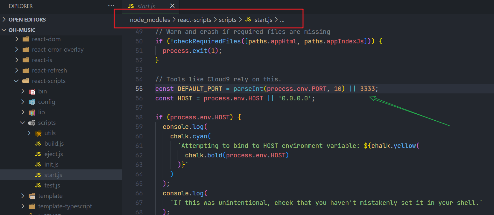
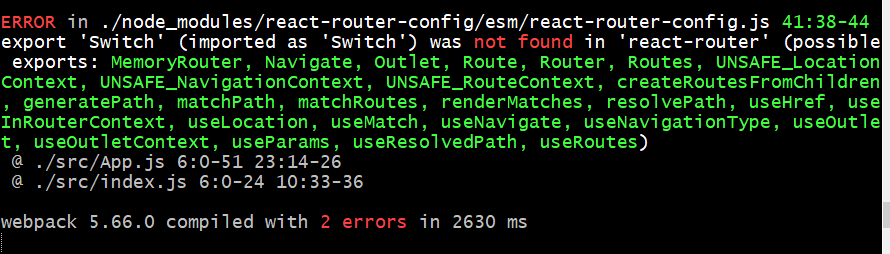

# oh-music-react

- 改默认端口号



则我们改进添加 `.env` 文件并写入 `PORT=3333`

- vscode 安装 `vscode-styled-components` 插件

- `yarn add react-router react-router-dom react-router-config`

- `react-router`，`react-router-dom` 版本为 6 导致报错，应该安装 5.2.0 左右的版本
  

- redux
  `yarn add immer redux redux-thunk react-redux`

- swiper

`yarn add swiper@4.5.1`，注意版本号。

- 配置别名

`yarn add @craco/craco`，然后创建 `craco.config.js` 文件并写入配置

- axios

不同环境：`.env.development` 中写入 `REACT_APP_BASE_URL=https://music-api-five.vercel.app`，通过 `process.env.REACT_APP_BASE_URL` 获取

- `react-lazyload`

视口内的图片显示真实资源，视口外则显示占位图片。当滑动时，让下面相应的图片显示：

```js
// 引入 forceCheck 方法
import { forceCheck } from 'react-lazyload';

// scroll 组件中应用这个方法
<Scroll className="list" onScroll={forceCheck}>
```
