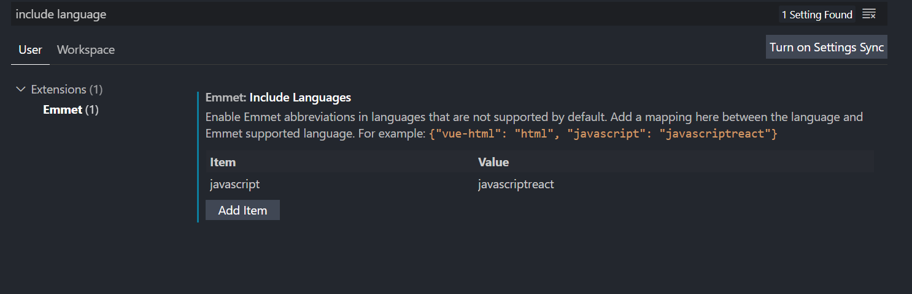
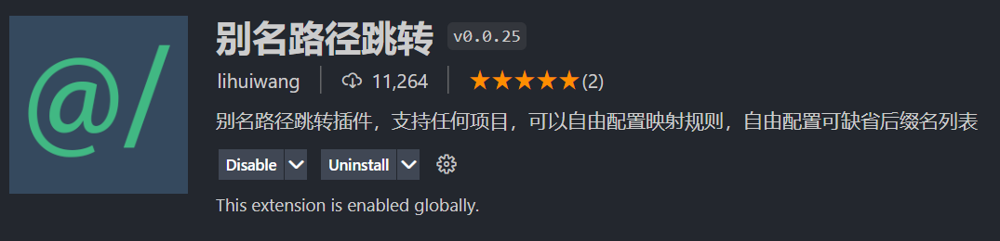

# oh-music-react

1.`jsx` 的 `html` 提示及补全



2.改默认端口号

直接改图中路径对应的代码：


其他方法：添加 `.env` 文件并写入 `PORT=3333`。

3.vscode 安装 `vscode-styled-components` 插件

4.`yarn add react-router react-router-dom react-router-config`

5.`react-router`，`react-router-dom` 版本为 6 导致使用时报错，应该安装 5.2.0 左右的版本。


6.redux
`yarn add immer redux redux-thunk react-redux`

7.swiper

`yarn add swiper@4.5.1`，注意版本号。

8.配置别名和安装「别名路径跳转」插件

`yarn add @craco/craco`，然后创建 `craco.config.js` 文件并写入配置。

插件如下，需要按说明到 `vscode` 的 `setting.json` 下写入相关配置。


9.axios

不同环境不同接口配置：`.env.development` 中写入 `REACT_APP_BASE_URL=https://music-api-five.vercel.app`，通过 `process.env.REACT_APP_BASE_URL` 获取。

10.`react-lazyload`

视口内的图片显示真实资源，视口外则显示占位图片。当滑动时，让下面相应的图片显示：

```js
// 引入 forceCheck 方法
import { forceCheck } from 'react-lazyload';

// scroll 组件中应用这个方法
<Scroll className="list" onScroll={forceCheck}>
```

11.`better-scroll` 个人犯错

将 `src/base-ui/scroll/index` 中的 `horizontal` 写错成了 `horizental`，而在其他文件中则全都写成 `horizontal`，导致一直无法滚动！

12.Singers 页面上拉加载、下拉刷新

13.在 App 组件中获取到 history 对象
App 组件必须包裹在 Router 组件之内，App 组件使用 withRouter 高阶组件包裹。

```js
// src/components/list/index.js
import { withRouter } from 'react-router-dom'
// ...
export default React.memo(withRouter(RecommendList))
```

14.渲染当前所在路由的下一层子路由

```js
import { renderRoutes } from 'react-router-config'

function Recommend(props) {
  // ...
  return (
    <Content>
      {/* ... */}
      {/* 将目前所在路由的下一层子路由加以渲染 */}
      {renderRoutes(props.route.routes)}
    </Content>
  )
}
```

15.切页动画

`yarn add react-transition-group`
